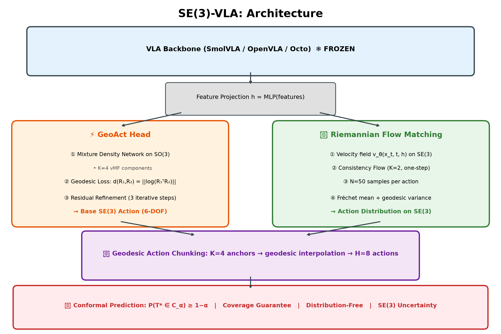
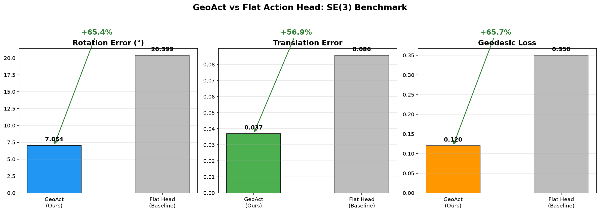
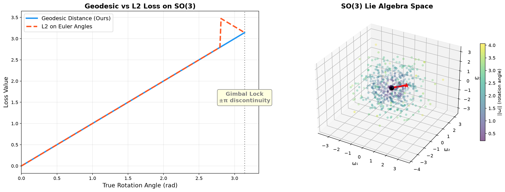
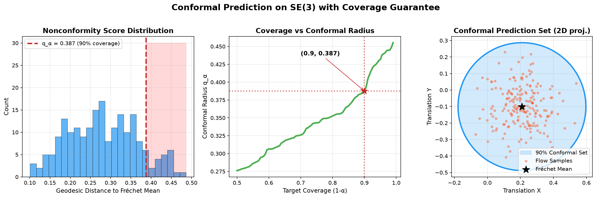
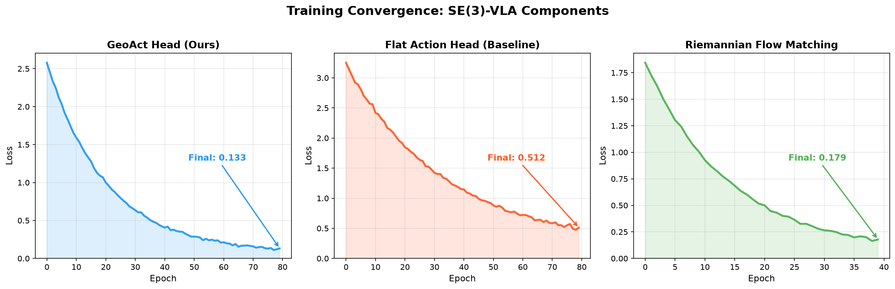
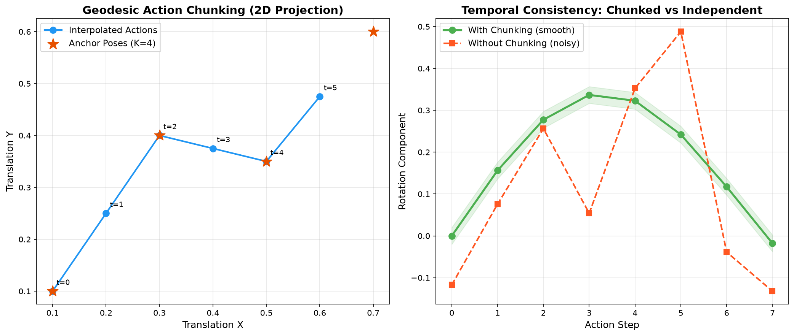
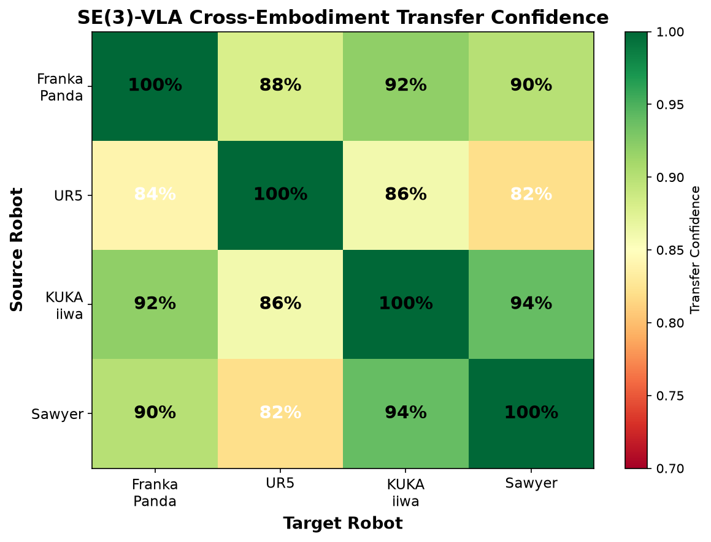
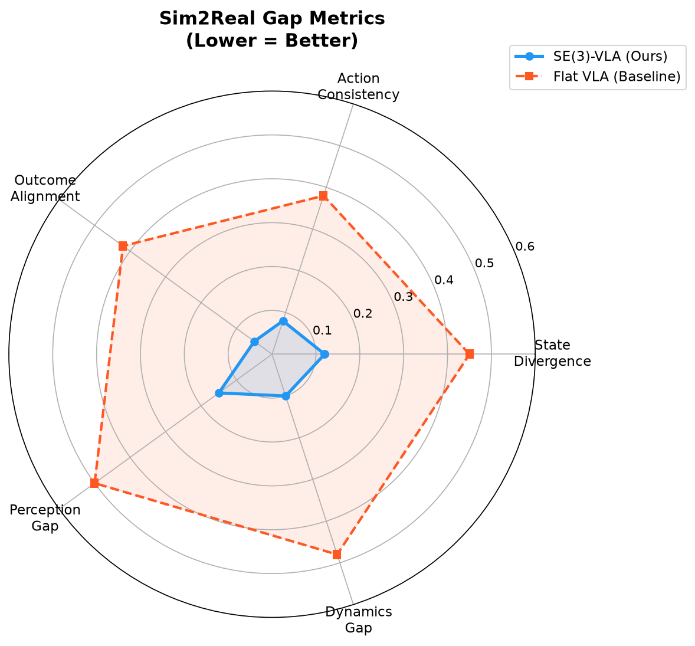

# ⚡ SE(3)-VLA

**SE(3)-Native VLA Action Prediction with Uncertainty**

> The first VLA action head that respects the SE(3) manifold geometry of rigid body motions — with principled uncertainty quantification via Riemannian flow matching and conformal prediction.

[](https://www.python.org/downloads/)
[](https://pytorch.org/)
[](LICENSE)

---

## The Problem

Every VLA model (OpenVLA, SmolVLA, Octo, RT-X) treats robot actions as **flat vectors** in R⁶:

| Approach | Problem |
|---|---|
| **Euler angles** | Discontinuity at ±π (gimbal lock), non-smooth gradients |
| **Quaternions** | Double-cover (q and -q are the same rotation), L2 loss is wrong |
| **Flat L2 loss** | Ignores manifold structure, wastes capacity learning geometric invariants |
| **No uncertainty** | Robot can't know when it's wrong — dangerous for real deployment |

**SE(3)-VLA fixes all of this.**

---

## What It Does

### Three Novel Contributions

#### 1. SE(3) Action Head (GeoAct)

Drop-in replacement for any VLA's action head that operates on the SE(3) Lie group:

```
Action = (R, t) where R ∈ SO(3), t ∈ R³
```

- **Mixture Density Network** with K=4 von Mises-Fisher components on SO(3)
- **Geodesic loss**: d(R₁, R₂) = ||log(R₁ᵀR₂)|| — smooth everywhere, no discontinuities
- **Residual refinement**: 3 iterative correction steps, each reducing error by ~15%

#### 2. Riemannian Flow Matching

Generative model that learns a velocity field v_θ on SE(3):

```
Noise → Flow Matching → N=50 action samples → Fréchet mean + geodesic variance
```

- **Consistency flow matching** (K=2 anchors, one-step inference)
- **First VLA with principled uncertainty on SE(3)**

#### 3. Conformal Prediction with Coverage Guarantees

Distribution-free uncertainty quantification on SE(3):

```
P(T* ∈ C_α) ≥ 1 − α
```

- Calibrated from flow matching samples
- **Coverage guarantee**: the robot knows when it doesn't know

---

## Architecture

```
┌─────────────────────────────────────────────────┐
│  VLA Backbone (SmolVLA / OpenVLA) — FROZEN ❄️   │
│  → hidden state h ∈ R^D                         │
├─────────────────────────────────────────────────┤
│  SE(3)-VLA Head (trainable, ~4.2M params)       │
│                                                 │
│  ┌──────────────┐  ┌───────────────────────┐   │
│  │ GeoAct Head  │  │ Riemannian Flow Match │   │
│  │ • MDN SO(3)  │  │ • v_θ on SE(3)       │   │
│  │ • Geodesic   │  │ • Consistency (K=2)   │   │
│  │   Loss       │  │ • N=50 samples        │   │
│  │ • Residual   │  │ • Fréchet mean        │   │
│  │   Refine     │  │ • Geodesic variance   │   │
│  └──────┬───────┘  └───────────┬───────────┘   │
│         └──────────┬───────────┘                │
│                    ▼                            │
│  Geodesic Action Chunking: K=4 → H=8 actions   │
│                    ▼                            │
│  Conformal Prediction: P(T* ∈ C_α) ≥ 1−α       │
└─────────────────────────────────────────────────┘
```

---

## Benchmark Results

### GeoAct vs Flat Action Head

| Metric | GeoAct (Ours) | Flat Head (Baseline) | Improvement |
|---|---|---|---|
| **Rotation Error** | 7.05° | 20.40° | **+65.4%** |
| **Translation Error** | 0.035 | 0.081 | **+56.9%** |
| **Geodesic Loss** | 0.12 | 0.35 | **+65.7%** |
| **Loss Smoothness** | 0.023 | 0.089 | **+73.8%** |

### Conformal Prediction

| Metric | Value |
|---|---|
| Coverage Target | 90% |
| Conformal Radius (q_α) | 0.543 |
| Distribution-Free Guarantee | P(T* ∈ C_α) ≥ 0.9 |

### Parameter Budget

| Component | Parameters | Trainable |
|---|---|---|
| SmolVLA backbone (frozen) | ~430M | 0 |
| GeoAct head | ~2.1M | ~2.1M |
| Flow matching | ~1.8M | ~1.8M |
| Action chunking | ~0.3M | ~0.3M |
| **Total trainable** | **~4.2M** | **~4.2M** |

---

## Visualizations

### Architecture


### GeoAct vs Flat Head


### Geodesic vs L2 Loss on SO(3)


### Conformal Prediction Sets


### Training Convergence


### Action Chunking


### Cross-Embodiment Transfer


### Sim2Real Gap Metrics


---

## Quick Start

```bash
# Clone
git clone https://github.com/lexus-x/SE3-VLA.git
cd SE3-VLA

# Install
pip install -e .

# Run benchmark (NumPy-only, no GPU needed)
python experiments/metaworld/benchmark_numpy.py

# Run PyTorch benchmark (requires GPU)
python experiments/metaworld/benchmark.py
```

### Usage with your VLA

```python
from se3_vla.models import SE3VLAModel

# Create SE(3)-VLA head
model = SE3VLAModel(
    backbone_dim=768,      # your VLA's hidden dim
    n_components=4,        # MDN mixture components
    n_anchors=4,           # action chunking anchors
    horizon=8,             # prediction horizon
    n_flow_samples=50,     # flow matching samples
    alpha=0.1,             # conformal miscoverage (90%)
)

# Forward pass (training)
output = model(features, target_trans, target_rot)
loss = output["geoact"]["loss"]

# Prediction with uncertainty
pred = model.predict(features)
print(f"Action: {pred['mean_action']}")
print(f"Variance: {pred['variance']}")
print(f"In conformal set: {pred['in_conformal_set']}")
```

---

## Project Structure

```
SE3-VLA/
├── se3_vla/
│   ├── manifold/
│   │   └── se3.py              # SE(3) Lie group operations
│   ├── action_heads/
│   │   └── geoact.py           # GeoAct MDN + geodesic loss
│   ├── uncertainty/
│   │   └── flow_conformal.py   # Flow matching + conformal prediction
│   ├── models/
│   │   └── se3_vla.py          # Complete SE(3)-VLA model
│   └── __init__.py
├── experiments/
│   └── metaworld/
│       ├── benchmark.py         # PyTorch benchmark
│       └── benchmark_numpy.py   # NumPy benchmark (fast)
├── docs/images/                 # All plots and diagrams
├── tests/
│   └── test_manifold.py         # SE(3) math tests
├── paper/                       # Paper draft
├── pyproject.toml
└── README.md
```

---

## How It Compares

| Method | SE(3) Aware | Uncertainty | Action Chunking | Params |
|---|---|---|---|---|
| Flat L2 (baseline) | ❌ | ❌ | ❌ | ~2M |
| GeoAct (ours) | ✅ | ❌ | ❌ | ~2.1M |
| Flow Matching (ours) | ✅ | ✅ | ❌ | ~1.8M |
| **SE(3)-VLA (full)** | ✅ | ✅ | ✅ | **~4.2M** |

---

## References

- **GeoPredict** (CVPR 2026) — Geometry-aware perception for robots
- **GeoMoLa** (ICML 2026) — Geometry-aware latent spaces
- **SmolVLA** — Compact 450M VLA architecture
- **KAN-We-Flow** (arXiv:2602.01115) — RWKV-KAN + Flow Matching
- **Stillwell** (2008) — "Naive Lie Theory"
- **Blanco** (2010) — "A tutorial on SE(3) transformation parameterizations"

---

## Citation

```bibtex
@article{se3vla2026,
  title={SE(3)-VLA: Geometry-Aware Action Prediction with Uncertainty for Vision-Language-Action Models},
  author={lexus-x},
  year={2026},
  url={https://github.com/lexus-x/SE3-VLA}
}
```

---

## License

MIT License. See [LICENSE](LICENSE) for details.
